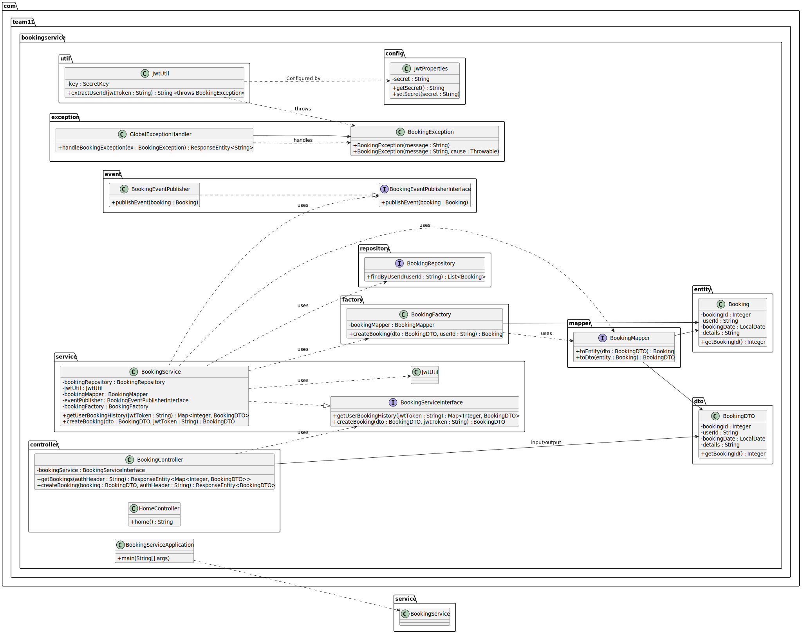

# Booking Service

## Overview

The **Booking Service** is a microservice that handles booking operations in a larger system. It is built using Spring Boot 3.x and leverages modern development practices (including Docker, Testcontainers, and OpenAPI documentation). The service is designed with robust architecture in mind, employing several Gang of Four (GoF) design patterns to ensure scalability, maintainability, and reusability while adhering to SOLID principles.

## Setup

### Minimum Requirements
- [Git](https://git-scm.com/downloads)
- [Java Development Kit (JDK) & Java Runtime Environment (JRE) versions 17+](https://adoptium.net/temurin/releases/?version=21)
- [Gradle](https://gradle.org/install/)
- [Docker](https://www.docker.com/get-started/)
- [PostgreSQL](https://www.postgresql.org/download/)

### Testing the Project
After cloning the project, run the following in a terminal window in the root of the project:

```bash
gradle wrapper
```

```bash
./gradlew build
```

> [!NOTE]
> If running gradlew results in an error, please ensure that the file has execute permission.

```bash
docker compose up
```

To check the current, automatically generated OpenAPI documentation, visit http://localhost:5555/swagger-ui/index.html for the UI. For the JSON, visit http://localhost:5555/v3/api-docs.

To connect to the bookingdb:

```bash
psql -h localhost -p 5434 -U postgres -d bookingdb
```

> [!NOTE]
> The DB name, username, and password can be found/modified in the .env file

Once testing has been completed, the containers can be stopped by either stopping them in Docker, or by pressing ctrl+c in the terminal session that ```docker compose up``` was ran in.

Then, do the following:

```bash
docker compose down
```

## Architecture

- **Microservices & Database Isolation:**  
  Each microservice in the project, including the Booking Service, manages its own database. For example, the Booking Service uses a dedicated PostgreSQL instance that is accessed internally via Docker networking (using service names) and externally via mapped host ports. This isolation prevents tight coupling between services and ensures clear data ownership.

- **Configuration Management:**  
  Configuration is handled through an `application.yml` file (with environment variables injected via a `.env` file for Docker Compose). This centralizes settings for the database connection, JWT secret, logging, and API documentation.

- **Containerization:**  
  The service is containerized using Docker and orchestrated with Docker Compose. Environment variables (such as `POSTGRES_DB_BOOKING`, `POSTGRES_USER_BOOKING`, and `POSTGRES_PASSWORD_BOOKING`) are used consistently across the application and container configuration to ensure seamless integration.

## Design Patterns

The project leverages multiple GoF design patterns to provide a clean, modular, and extendable architecture:

### 1. Observer Pattern
- **Usage:**  
  The `BookingEventPublisherInterface` and its implementation embody the Observer pattern. This design allows the Booking Service to publish events (such as booking creation) to multiple observers without tight coupling.
- **Benefits:**  
  Enables decoupled event handling and easy extension by adding additional subscribers to respond to booking events.

### 2. Adapter Pattern
- **Usage:**  
  MapStruct’s `BookingMapper` acts as an Adapter, converting between `Booking` entities and `BookingDTO` objects. This decouples the persistence layer from the presentation layer.
- **Benefits:**  
  Simplifies data conversion, reduces boilerplate code, and isolates changes in data representation to a single component.

### 3. Facade Pattern
- **Usage:**  
  The `BookingService` functions as a Facade. It presents a unified interface to client code by orchestrating multiple subsystems, such as repository access, JWT token decoding, mapping, and event publishing.
- **Benefits:**  
  Simplifies the client interface, hides complex interactions between subsystems, and enhances modularity.

### 4. Singleton Pattern
- **Usage:**  
  Spring’s default bean scope is singleton. All core components (services, repositories, utility classes) are instantiated as singletons.
- **Benefits:**  
  Ensures consistent behavior across the application and reduces resource overhead by reusing the same instance.

### 5. Factory Method Pattern
- **Usage:**  
  A dedicated `BookingFactory` encapsulates the creation logic of `Booking` entities from `BookingDTO` objects. This isolates instantiation details (like default booking dates or user ID assignment) from business logic.
- **Benefits:**  
  Enhances robustness, improves testability, and adheres to the Single Responsibility Principle by centralizing object creation.

### 6. (Pending) Strategy Pattern
- **Usage:**  
  While not fully implemented, the design is open to incorporating the Strategy pattern for tasks such as JWT validation or booking creation under different business rules.
- **Benefits:**  
  Allows dynamic switching between algorithms, promoting flexibility and adherence to the Open/Closed Principle.

## Adherence to SOLID Principles

The project is designed with SOLID principles in mind:

- **Single Responsibility Principle (SRP):**  
  Each class has a well-defined responsibility. For example, `JwtUtil` handles JWT extraction, `BookingMapper` handles conversion between entities and DTOs, and `BookingFactory` handles object creation.

- **Open/Closed Principle (OCP):**  
  Components such as `BookingService` and `BookingFactory` are designed to be extended with new behavior (e.g., new event handlers or alternative creation strategies) without modifying existing code.

- **Liskov Substitution Principle (LSP):**  
  Interfaces (e.g., `BookingEventPublisherInterface`) ensure that components can be interchanged with minimal impact, promoting flexibility in implementation.

- **Interface Segregation Principle (ISP):**  
  The service is divided into small, purpose-specific interfaces, such as separate repositories, service interfaces, and event publishers, preventing bloated interfaces.

- **Dependency Inversion Principle (DIP):**  
  High-level modules depend on abstractions rather than concrete implementations, facilitated by Spring’s dependency injection. This decouples components and improves testability.

## Implementation Highlights

### BookingService

- **Facade Implementation:**  
  The `BookingService` provides a simple interface for retrieving booking history and creating new bookings. It encapsulates interactions with the repository, JWT token processing, data mapping, and event publication.
- **Data Structures:**  
  Although the repository returns a `List` (the natural output from JPA queries), the service converts this list into a `HashMap` for constant-time lookup operations.
- **Event Handling:**  
  Once a booking is created, an event is published using the Observer pattern, decoupling the booking logic from event processing.

### BookingFactory

- **Factory Method Pattern:**  
  The `BookingFactory` encapsulates the logic for creating `Booking` entities from `BookingDTO` objects. It ensures that required defaults (such as the current date for bookings without a specified date) are applied, and that the user ID is correctly set from the JWT token.
- **Isolation of Creation Logic:**  
  This separation improves maintainability and testability, making it easier to modify booking creation logic without impacting the service layer.

### MapStruct BookingMapper

- **Adapter Pattern:**  
  The BookingMapper, implemented via MapStruct, converts between Booking entities and BookingDTOs. This cleanly separates the persistence model from the API model.
- **Code Quality:**  
  By eliminating boilerplate mapping code, it minimizes potential errors and enhances code clarity.

### JWT Utility (JwtUtil)

- **Single Responsibility:**  
  The `JwtUtil` class is solely responsible for extracting user information from JWT tokens. It adheres to SRP by not mixing concerns like token generation or validation logic with other service logic.
- **Error Handling:**  
  It throws custom `BookingException` errors to handle cases where the token is missing, invalid, or lacks a valid subject.

## Avoidance of Code Smells

- **Removal of Unused Code:**  
  The logger field previously associated with an obsolete event-publishing method in `BookingService` was removed to prevent confusion and reduce clutter.
- **Clear Separation of Concerns:**  
  Each class and component is designed with a single purpose, ensuring that functionality is modular, testable, and maintainable.
- **Dependency Injection:**  
  Spring’s DI is leveraged throughout, which not only facilitates testing but also reduces coupling between components.
- **Consistent Naming and Configuration:**  
  Environment variables, configuration files, and Docker Compose settings are used consistently, reducing the chance of misconfiguration and runtime errors.

## UML Diagrams

### Class Diagram



### Sequence Diagrams

#### Booking Creation


#### User Booking History Retrieval


