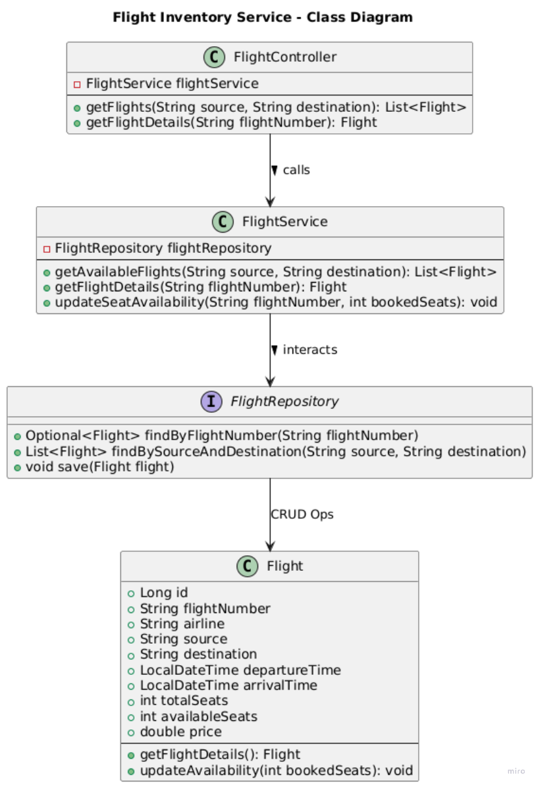

## **FlightService - README**
### **Overview**
FlightService is a **Spring Boot** microservice responsible for **managing flight inventory**, including:
- **Searching for flights** based on source, destination, and departure date.
- **Retrieving flight details** by flight number.
- **Updating available seats** when a booking is made.

This service uses:
- **Spring Boot** for API development.
- **PostgreSQL** as the database.
- **Docker & Docker Compose** for containerized deployment.
- **Gradle** for dependency management.

---

## **UML Diagram**
Below is a UML **class diagram** representing the **FlightService** architecture.



### **Components:**
- `FlightController`: Handles API requests.
- `FlightService`: Business logic for retrieving and updating flight data.
- `FlightRepository`: JPA repository for database interactions.
- `Flight`: Entity representing flight details.

---

## **Setup & Installation**
### **Prerequisites**
Ensure you have:
- **Docker & Docker Compose** (for containerized deployment)
- **Java 17** (for local development)
- **PostgreSQL** (if running locally)
- **cURL** (for API testing)

### **Running the Service**
#### **1. Build the JAR File**
```sh
./gradlew build
```
or
```sh
./gradlew bootJar
```

#### **2. Start the Service with Docker**
Run the following:
```sh
docker-compose up --build
```
This starts:
- **flightdb** (PostgreSQL database)
- **flightservice** (Spring Boot application on port `8082`)

---

## **API Endpoints**
### **1. Get Available Flights**
Retrieve flights by **source, destination, and departure date**.
```sh
curl -X GET "http://localhost:8082/api/flights/search?source=London&destination=New%20York&departureDate=2025-03-11" -H "Content-Type: application/json"
```

### **2. Get Flight Details**
Retrieve flight details by **flight number**.
```sh
curl -X GET "http://localhost:8082/api/flights/BA202" -H "Content-Type: application/json"
```

### **3. Update Seat Availability**
Reduce available seats for a specific flight.
```sh
curl -X PUT "http://localhost:8082/api/flights/BA202/updateSeats?bookedSeats=100" -H "Content-Type: application/json"
```

---

## **Database Management**
### **Access the Flight Database**
Log into **PostgreSQL** inside the **flightdb** container:
```sh
docker exec -it flightdb psql -U postgres -d flightdb
```
Then, check flight records:
```sql
SELECT * FROM flights;
```

---

## **Stopping the Service**
To stop the containers, run:
```sh
docker-compose down
```

---

## **Troubleshooting**
### **1. Database Connection Issues?**
- Check if the database is running:
  ```sh
  docker ps
  ```
- Verify `application.yml` and `docker-compose.yml` for the correct **database URL**.

### **2. Service Fails Due to Missing Dependencies?**
Run:
```sh
./gradlew clean build
docker-compose up --build
```

### **3. Check FlightService Logs**
```sh
docker logs -f flightservice
```

---

## **Next Steps**
- **Integrate Kafka** for event-based messaging.
- **Implement JWT Authentication** for secure API access.